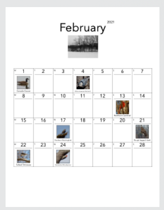

# calendargen
Generate calendars (locally via browser/javascript) with optional images placed for each month and by month/day (calendargen is extended from [calendar-maker](https://github.com/jpraetorius/calendar-maker) ).

## See live examples:
[Calendar - Birds In Season](https://wittman.github.io/calendargen/birds-in-season/index.html)

[Calendar - Space Exploration](https://wittman.github.io/calendargen/space-exploration/index.html)

[Calendar - Blank Template](https://wittman.github.io/calendargen/blank-template/index.html)

## Use as a template for your own photo calendars

Clone/download unzip to local file system.

There are two photo calendar samples:

`/calendargen`  
`|- /birds-in-season`  
`|- /space-exploration`

and a blank template:

`/calendargen`  
`|- /blank-template`

## Simplest use:

- Make a copy of `/blank-template` directory and rename it as a starter for your own calendar—for reference here let's call it `/my-calendar`.

- In browser use <em>File > Open File</em> and choose `/my-calendar/index.html`.

- Click <em>Generate</em> button at top.

- It's designed for an 8.5" x 11" portrait mode page layout. Review via your browser's print preview and then print to paper or save as PDF.

**Important:** (under _More Settings_) in print preview turn `off` _print headers and footers_ option; turn `on` _print backgrounds_.

- Controls: Change year and/or starting month and click Generate to re-render calendar.

## More advanced use:

The core app files are:

`/calendargen`  
`|- /app`  
`|--- app.js`  
`|--- style.css`  
`|--- print.css`

Customize styles per calendar (add declarations in style.css):  
`/calendargen`  
`|- /my-calendar`  
`|--- style.css`

### Photos
By default:  
_Month-day_ images are set as background in a 100x100px container as scaled with background-size: 100px.  
_Month_ images are backgrounds in a 239px wide x 180px high container, scaled to background-size: 239px.

**To add _month-day_ photos there are two steps:**
1. Name image month-day (e.g. `1-8.jpg` for Jan 8th. And `12-29.png` for Dec 29th) and place files in `/my-calendar/img`.
2. Edit `/my-calendar/app-data.js` and add a property-value to `const imgs` (more details below).

Define the photo data (image file names, captions, links):  
The `imgs` object property is the month `[1-12]` + `-` + day `[1-31]` + image file extension [`.jpg`, `.png`, etc...]':

`const imgs = {`  
` '1-8.jpg'   : ['https://en.wikipedia.org/wiki/Earth#/media/File:The_Earth_seen_from_Apollo_17.jpg', 'Earth', ''],`  
` '12-29.jpg' : ['https://en.wikipedia.org/wiki/File:FullMoon2010.jpg', 'Moon', '']`  
`}`

The `imgs` object property's key is an array.  
index:  
 `[0]` is URL to original image source online

 `[1]` is image caption (text or html, but if html then only markup with one enclosing tag such as `Make A Long Caption Fit`)

 `[2]` is css style that may be needed (such as background-size, background-position)

(each element value in array is optional, put an empty string if not using)

### Month (only) Photos
To add month images uses the above month-day conventions except:  
- Name file `1.jpg` for January,  and `8.png` for August, etc...  
- Put images in `/my-calendar/img/month`
- Define data in `const monimgs`.

### Odds & Ends
Compatibility: Tested in Chrome, Firefox and Safari (curiously, Firefox and Safari have almost instant print preview rendering and Chrome takes several seconds or more).

Another oddity: Firefox on Windows does not display the calendar box borders in print preview, but they appear normally when printed.

### Dedication

This little project sprung from making a tribute for my friend [John](https://wittman.org/blog/birds-in-season/) (the Birds in Season calendar).
